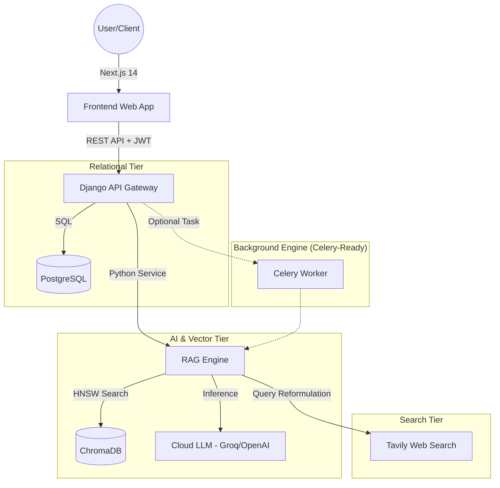

# High-Level Design (HLD): KnowBot 3.0

## 1. Executive Summary
KnowBot 3.0 is an Enterprise-grade RAG (Retrieval-Augmented Generation) system designed to transform static documents into interactive, context-aware knowledge agents. It features a "Dual-Brain" architecture that separates relational metadata from semantic vector data, ensuring both strict data integrity and fluid intelligence.

---

## 2. System Architecture

---

## 3. Component Deep Dive

### 3.1. Frontend (The Vision)
*   **Next.js 14 App Router:** Provides lightning-fast server-side rendering and client-side interactivity.
*   **State Management (Context API):** Manages real-time chat streams, document upload progress, and global bot states (idle/thinking).
*   **Framer Motion UI:** Implements high-end "Cybernetic" aesthetics with fluid animations (huge bot presence, glowing chat).

### 3.2. API Gateway (The Controller)
*   **Django REST Framework (DRF):** Orchestrates security, user authentication (JWT), and resource management.
*   **Multi-tenant Isolation:** Uses metadata filtering at the database and vector levels to ensure User A never reads User B's documents.
*   **Stateless Scaling:** Configured for cloud-native deployment with health checks and horizontal scalability.

### 3.3. RAG Engine (The Intelligence)
*   **Hybrid Retrieval Pattern:** Combines **Vector Similarity (Semantic)** with **BM25 (Keyword)** search using Reciprocal Rank Fusion (RRF).
*   **Contextual Reformulation:** Rewrites user's short-hand queries into standalone search terms for more accurate retrieval.
*   **Smart Thinking Stream:** Tracks and surfaces the "Internal Chain-of-Thought" (Retrieval -> Filtering -> Reasoning) to the UI for transparency.

---

## 4. Technical Stack

*   **Languages:** Python 3.11, TypeScript 5.0
*   **Backend:** Django, Django REST Framework, Celery
*   **Frontend:** Next.js 14, React, Tailwind CSS, Framer Motion
*   **Databases:** PostgreSQL (Relational), ChromaDB (Vector)
*   **AI Inference:** Groq (Llama 3.3 70B), OpenAI (Embeddings)
*   **Deployment:** Railway (Backend/DB), Vercel (Frontend)

---

## 5. Key Design Patterns

*   **Hybrid Storage Pattern:** Decoupling object metadata (Postgres) from semantic meaning (Chroma).
*   **Singleton Pattern:** Used in the `VectorStoreManager` to ensure only one active connection is maintained to the vector index, preventing file-lock errors.
*   **Strategy Pattern:** The RAG system can switch between different 'Personalities' (System Prompts) and Search Engines (Local vs. Web) dynamically.
*   **Graceful Fallback:** The system detects infrastructure limits (like missing Celery Workers) and automatically switches from asynchronous to synchronous processing to maintain uptime.

---

## 6. Security & Scalability

*   **Tenant Sandboxing:** All queries are strictly scoped by `user_id` at every layer of the stack.
*   **Rate Limiting:** Protects expensive LLM and Search API calls from abuse.
*   **Ephemeral Readiness:** Built to handle container restarts by treating the application tier as stateless, with all persistence offloaded to managed database services.
